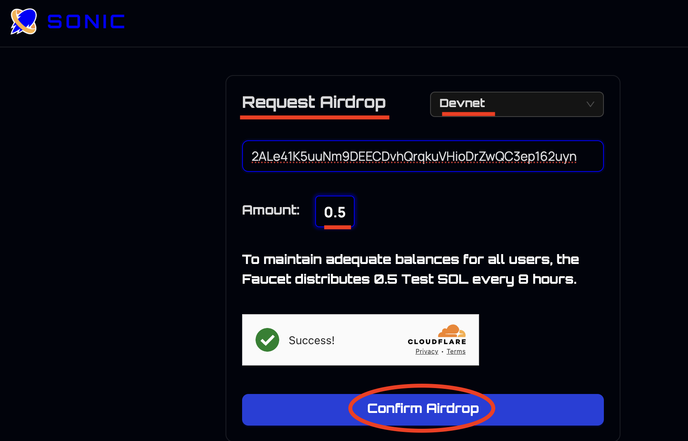
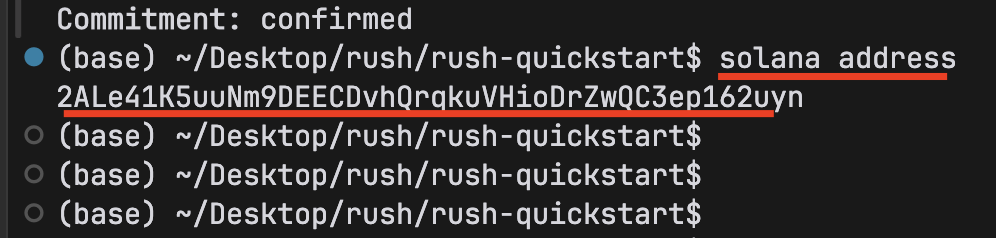
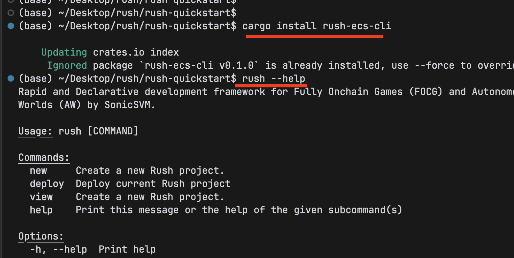
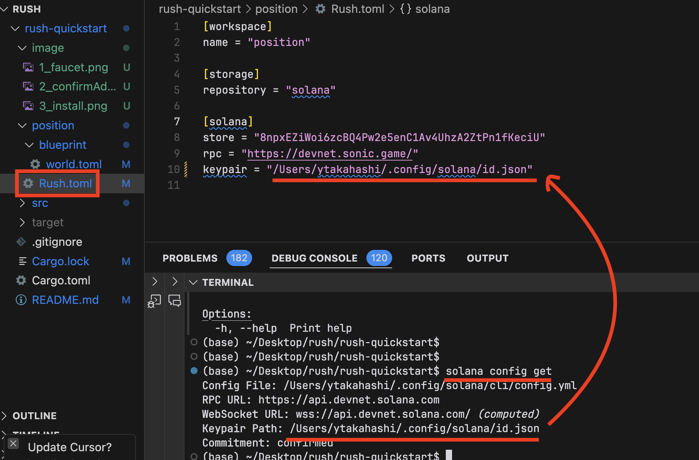
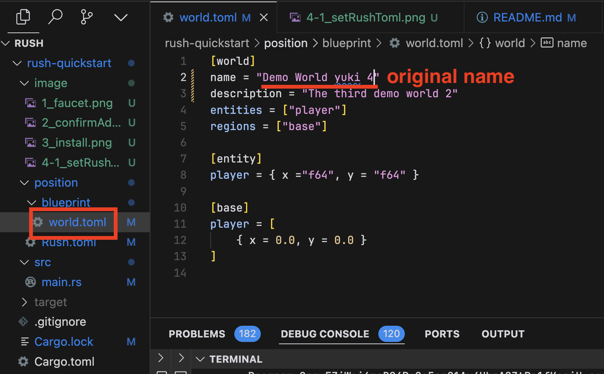
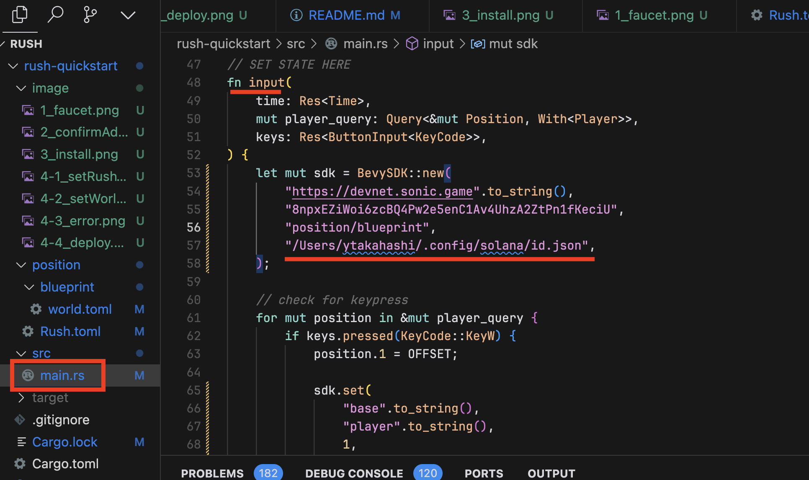
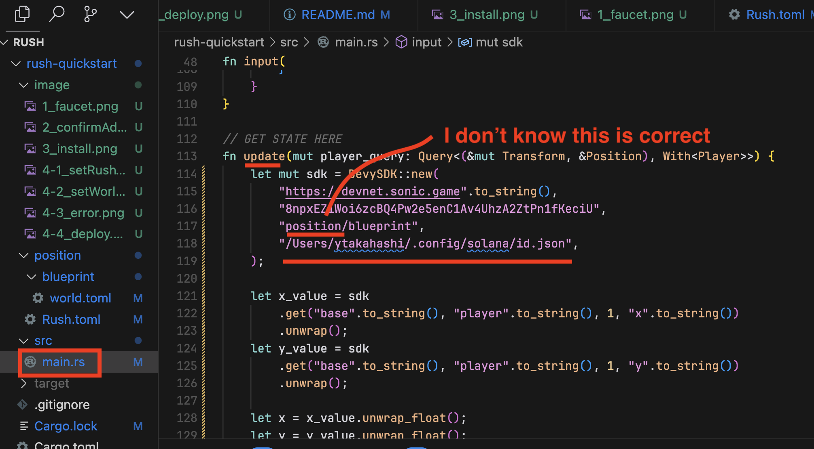
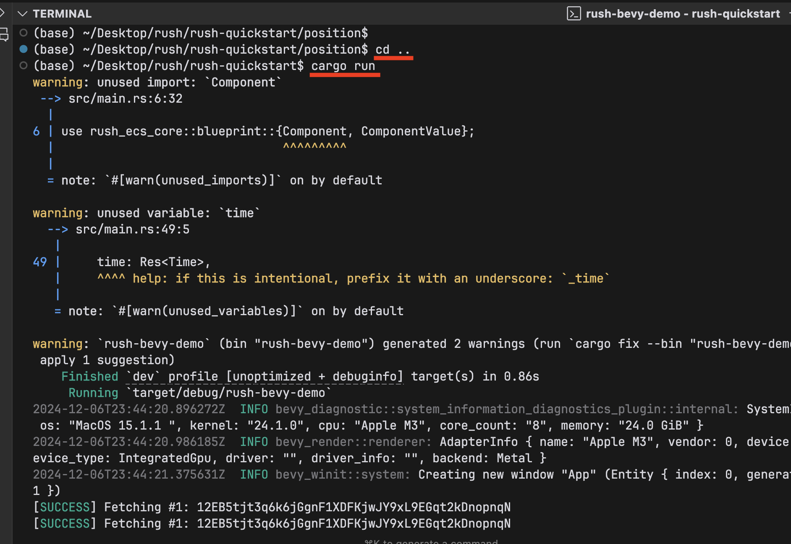
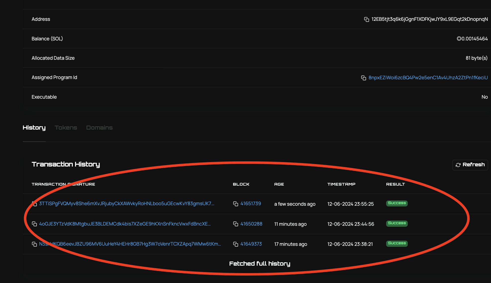

# 1 Set your cli to sonic Devnet

set sonic devnet like this

```
solana config set --url https://devnet.sonic.game
```

after the test , you should return to the solana devnet and so on like this

```
solana config set --url devnet
```

# 2 Get sonic Devnet token

let's go to the sonic faucet

```
https://faucet.sonic.game/
```



and you can check your address like this

```
solana address
```



# 3 Install rush-ecs-cli

```
cargo install rush-ecs-cli
```

and check

```
rush
```



# 4 Deploy

## 1 Git clone the quick-start repository

```
git clone https://github.com/mirrorworld-universe/rush-quickstart.git
```

## 2 Set Rush.toml to your key pair



## 3 Change the name in world.toml



if the name is not original, this error happens

## 4 deploy

```
rush deploy
```

# 5 Run

## 1 cargo add

```
cargo add rush_ecs_core rush_ecs_sdk
```

## 2 return the comment out

## 3 change input function



## 4 change upload function



## 5 run



```
rush deploy
```

# 6 Explorer

the explorer is here

```
https://explorer.sonic.game/
```



# What is Rush Quickstart?

> [!WARNING]
> 🚧 Rush is under heavy development. Expect **bugs**, **crashes**, **breaking changes**, and **partial experiences** so we can ship fast, break things, and iterate to bring you the best onchain game development experience.

**Rush Quickstart** is a simple Bevy game repository demonstrating how a Bevy game can be converted into an onchain game by using SonicSVM's Rush ECS framework.
